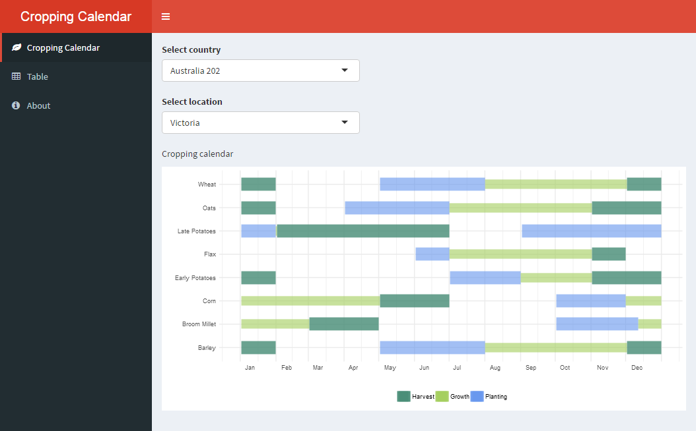
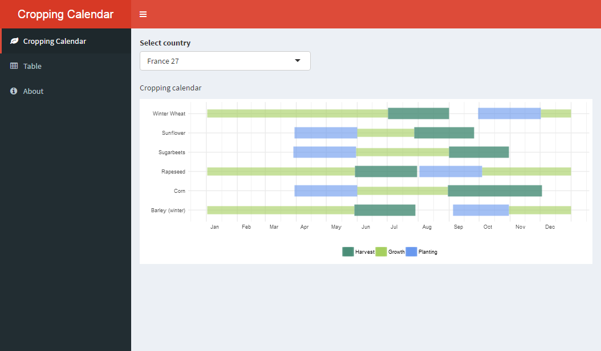

## Cropping calendar visualization

An app to visualize key dates for various crops using the Cropping Calendar dataset. Once you make a selection of the region using drop-down menus, the calendar will be displayed.

## Demo

Live demo at [https://asheshwor.shinyapps.io/cropcal/](https://asheshwor.shinyapps.io/cropcal/)

This app can also be run from RStudio using the following code:

```R
## Install missing packages
packagesRequired <- c("shiny", "rgeos", "RColorBrewer",
                      "dplyr", "ggplot2")
packagesToInstall <- packagesRequired[!(packagesRequired %in%
                                          installed.packages()[,"Package"])]
if(length(packagesToInstall)) install.packages(packagesToInstall)
## Run app from Github repo
shiny::runGitHub('asheshwor/cropcal')
```

## Screenshots


<small>Screenshot of app</small>


<small>Screenshot of app</small>

## Data source

Cropping calendar data from [Sacks et al. (2010)](https://nelson.wisc.edu/sage/data-and-models/crop-calendar-dataset/index.php).

## To-do

* fix overlaps with some cases
* add associated climate data

## License:

Code distributed under the terms of the [MIT license](https://github.com/asheshwor/cropcal/blob/master/LICENSE).

See individual licenses for external data/tools used if any.

## References
* Sacks, W.J., D. Deryng, J.A. Foley, and N. Ramankutty (2010). Crop planting dates: an analysis of global patterns. Global Ecology and Biogeography 19, 607-620. DOI: 10.1111/j.1466-8238.2010.00551.x
