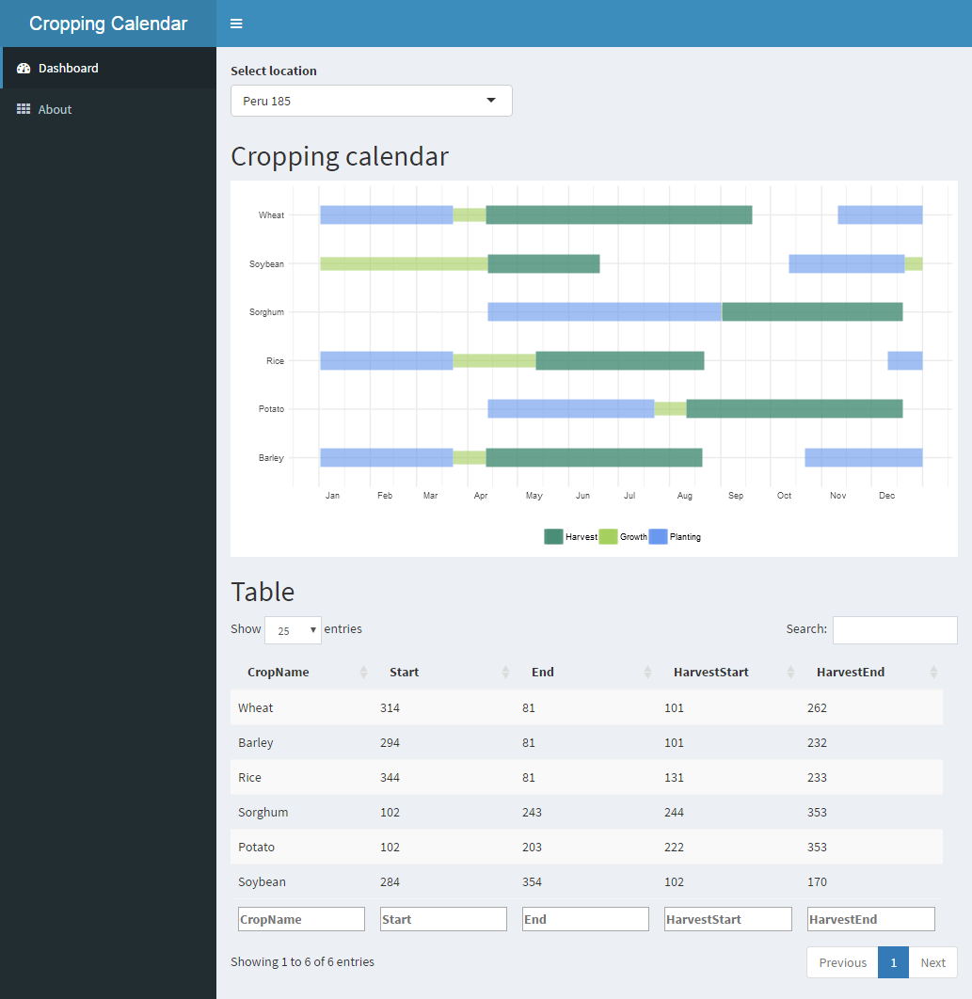
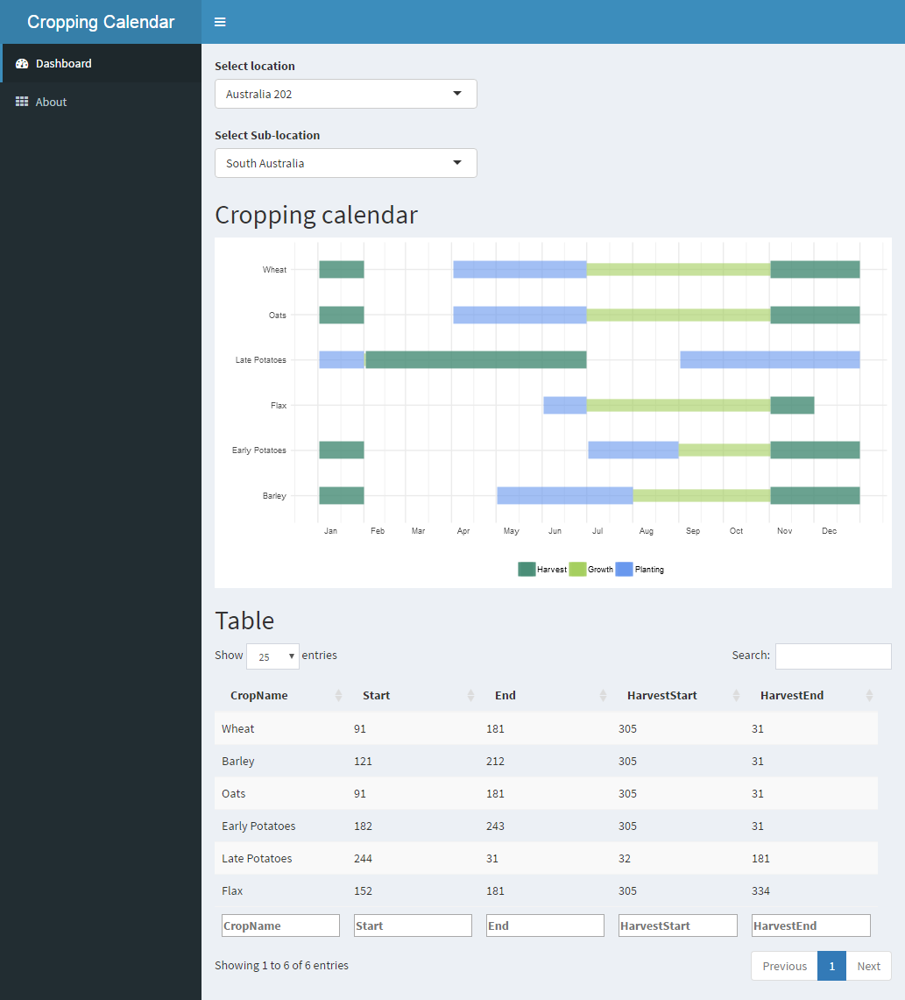

## Cropping calendar visualisation

An app to visualisie cropping calendars for selected regions. Once you make a selection of the region using drop-down menus, the calendar will be displayed.

## Demo

Live demo is unavailable, but you can run the app from RStudio using the following code:

```R
## Install missing packages
packagesRequired <- c("shiny", "rgeos", "RColorBrewer",
                      "dplyr", "ggplot2")
packagesToInstall <- packagesRequired[!(packagesRequired %in%
                                          installed.packages()[,"Package"])]
if(length(packagesToInstall)) install.packages(packagesToInstall)
## Run app from Github repo
shiny::runGitHub('asheshwor/cropcal')
```

## Screenshots


<small>Screenshot of app</small>


<small>Screenshot of app</small>

## Data source

Data
Note: Cropping calendar data from https://nelson.wisc.edu/sage/data-and-models/crop-calendar-dataset/index.php.

## To-do

* fix overlaps with some data
* add associated climate data

## License:

Code distributed under the terms of the [MIT license] (https://github.com/asheshwor/cropcal/blob/master/LICENSE)

See individual licenses for external data/tools used if any.
